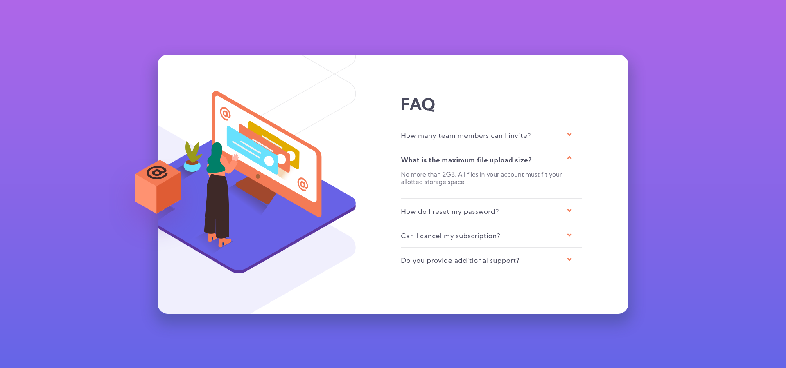
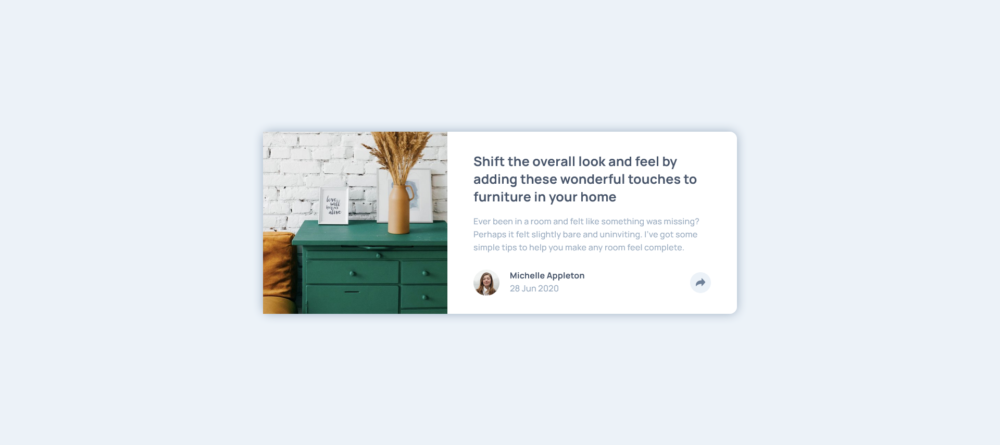

# Frontend Mentor - My solutions to challenges

|  #  |                            Challenge                            |                        Live Demo                        |                                                 GitHub                                                 |
| :-: | :-------------------------------------------------------------: | :-----------------------------------------------------: | :----------------------------------------------------------------------------------------------------: |
| 01  | [FAQ Accordion Card without JS](#faq-accordion-card-without-js) | [URL](https://faq-accordion-card-delta-ten.vercel.app/) | [Repo](https://github.com/AndyGuit/frontend-mentor-challenges/tree/master/faq-accordion-card-main) |
| 02  | [Article preview component](#article-preview-component) | [URL](https://article-preview-component-brown.vercel.app/) | [Repo](https://github.com/AndyGuit/frontend-mentor-challenges/tree/master/article-preview-component-master) |

## FAQ Accordion Card without JS

- Live Site URL: [FAQ Accordion Card](https://faq-accordion-card-delta-ten.vercel.app/)
- GitHub Repo: [FAQ Accordion Card](https://github.com/AndyGuit/frontend-mentor-challenges/tree/master/faq-accordion-card-main)

## Article preview component

- Live Site URL: [Article preview component](https://article-preview-component-brown.vercel.app/)
- GitHub Repo: [Article preview component](https://github.com/AndyGuit/frontend-mentor-challenges/tree/master/article-preview-component-master)

