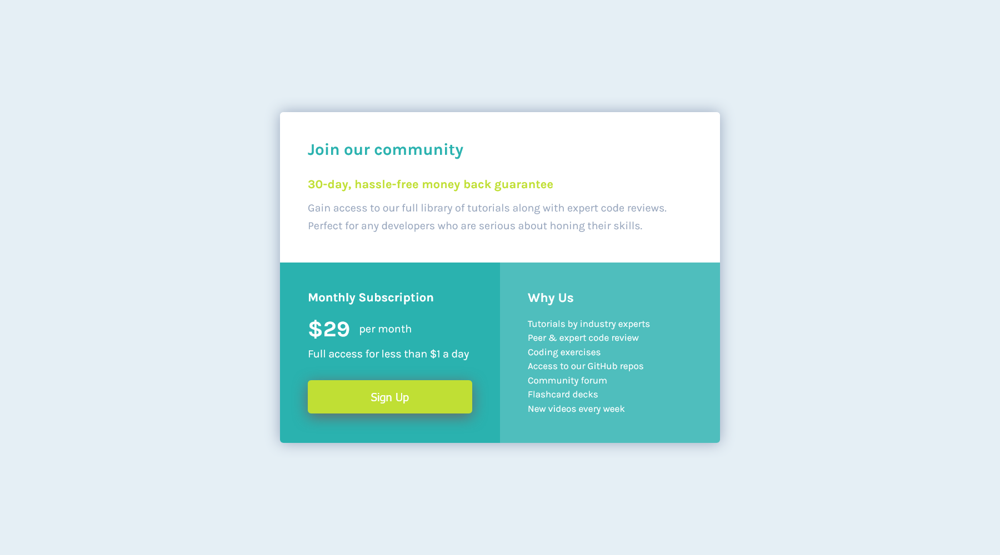
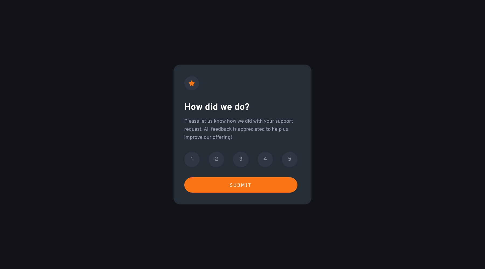

# Frontend Mentor - My solutions to challenges

|  #  |                            Challenge                            |                        Live Demo                        |                                                 GitHub                                                 |
| :-: | :-------------------------------------------------------------: | :-----------------------------------------------------: | :----------------------------------------------------------------------------------------------------: |
| 01  | [FAQ Accordion Card without JS](#faq-accordion-card-without-js) | [URL](https://faq-accordion-card-delta-ten.vercel.app/) | [Repo](https://github.com/AndyGuit/frontend-mentor-challenges/tree/master/faq-accordion-card-main) |
| 02  | [Article preview component](#article-preview-component) | [URL](https://article-preview-component-brown.vercel.app/) | [Repo](https://github.com/AndyGuit/frontend-mentor-challenges/tree/master/article-preview-component-master) |
| 03  | [Single price grid component](#single-price-grid-component) | [URL](https://single-price-grid-component-lime-one.vercel.app/) | [Repo](https://github.com/AndyGuit/frontend-mentor-challenges/tree/master/single-price-grid-component-master) |
| 04  | [Interactive rating component](#interactive-rating-component) | [URL](https://interactive-rating-component-lovat-theta.vercel.app/) | [Repo](https://github.com/AndyGuit/frontend-mentor-challenges/tree/master/interactive-rating-component-main) |
| 05  | [Base Apparel coming soon page](#base-apparel-coming-soon-page) | [URL](https://base-apparel-coming-soon-two-tawny.vercel.app/) | [Repo](https://github.com/AndyGuit/frontend-mentor-challenges/tree/master/base-apparel-coming-soon-master) |

## FAQ Accordion Card without JS

- Live Site URL: [FAQ Accordion Card](https://faq-accordion-card-delta-ten.vercel.app/)
- GitHub Repo: [FAQ Accordion Card](https://github.com/AndyGuit/frontend-mentor-challenges/tree/master/faq-accordion-card-main)

## Article preview component

- Live Site URL: [Article preview component](https://article-preview-component-brown.vercel.app/)
- GitHub Repo: [Article preview component](https://github.com/AndyGuit/frontend-mentor-challenges/tree/master/article-preview-component-master)

## Single price grid component

- Live Site URL: [Single price grid component](https://single-price-grid-component-lime-one.vercel.app/)
- GitHub Repo: [Single price grid component](https://github.com/AndyGuit/frontend-mentor-challenges/tree/master/single-price-grid-component-master)

## Interactive rating component

- Live Site URL: [Interactive rating component](https://interactive-rating-component-lovat-theta.vercel.app/)
- GitHub Repo: [Interactive rating component](https://github.com/AndyGuit/frontend-mentor-challenges/tree/master/interactive-rating-component-main)

## Base Apparel coming soon page

- Live Site URL: [Base Apparel coming soon page](https://base-apparel-coming-soon-two-tawny.vercel.app/)
- GitHub Repo: [Base Apparel coming soon page](https://github.com/AndyGuit/frontend-mentor-challenges/tree/master/base-apparel-coming-soon-master)

