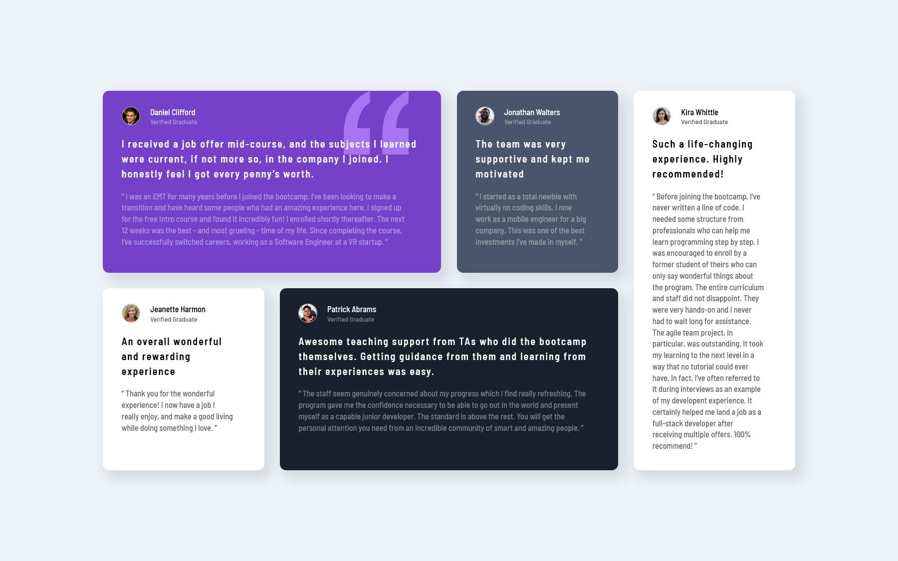

# Frontend Mentor - Testimonials grid section solution

This is a solution to the [Testimonials grid section challenge on Frontend Mentor](https://www.frontendmentor.io/challenges/testimonials-grid-section-Nnw6J7Un7). Frontend Mentor challenges help you improve your coding skills by building realistic projects.

## Table of contents

- [Overview](#overview)
  - [The challenge](#the-challenge)
  - [Screenshot](#screenshot)
  - [Links](#links)
- [My process](#my-process)
  - [Built with](#built-with)
  - [Continued development](#continued-development)
- [Author](#author)

## Overview

### The challenge

Users should be able to:

- View the optimal layout for the component depending on their device's screen size

### Screenshot

### Links

- Live Site URL: [Testimonials grid section](https://single-price-grid-component-lime-one.vercel.app/)

## My process

### Built with

- Semantic HTML5 markup
- CSS custom properties
- CSS Grid
- Mobile-first workflow

### Continued development

- Mobile-first workflow
- Responsive web design
- CSS Grid

## Author

- LinkedIn - [Andrey Dmytryk](www.linkedin.com/in/andyguit)
- GitHub - [AndyGuit](https://github.com/AndyGuit)
- Frontend Mentor - [AndyGuit](https://www.frontendmentor.io/profile/AndyGuit)
