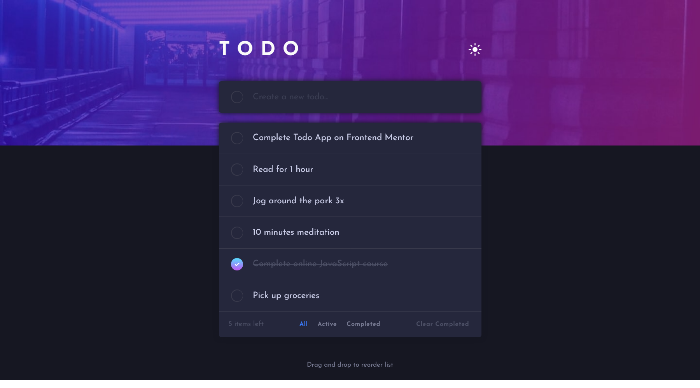
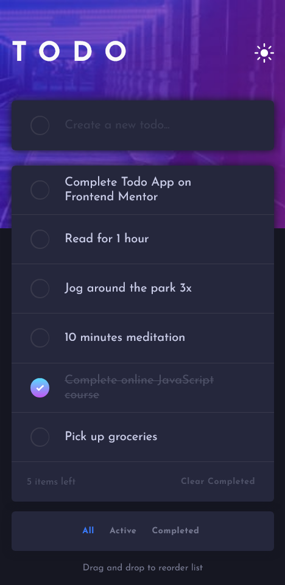

# Frontend Mentor - Time tracking dashboard solution

This is a solution to the [Todo app challenge on Frontend Mentor](https://www.frontendmentor.io/challenges/todo-app-Su1_KokOW). Frontend Mentor challenges help you improve your coding skills by building realistic projects.

## Table of contents

- [Overview](#overview)
  - [The challenge](#the-challenge)
  - [Screenshot](#screenshot)
  - [Links](#links)
- [My process](#my-process)
  - [Built with](#built-with)
  - [Continued development](#continued-development)
- [Author](#author)

## Overview

### The challenge

Users should be able to:

- View the optimal layout for the site depending on their device's screen size
- See hover states for all interactive elements on the page
- Add new todos to the list
- Mark todos as complete
- Delete todos from the list
- Filter by all/active/complete todos
- Clear all completed todos
- Toggle light and dark mode
- **Bonus**: Drag and drop to reorder items on the list

### Screenshot

### Links

- Live Site URL: [Todo App](https://time-tracking-dashboard-eight-rho.vercel.app/)

## My process

### Built with

- Semantic HTML5 markup
- SCSS
- React
- Redux Toolkit
- React Beautiful d-n-d library for Drag-n-Drop feature

### Continued development

- React
- Redux Toolkit

## Author

- LinkedIn - [Andrey Dmytryk](www.linkedin.com/in/andyguit)
- GitHub - [AndyGuit](https://github.com/AndyGuit)
- Frontend Mentor - [AndyGuit](https://www.frontendmentor.io/profile/AndyGuit)
